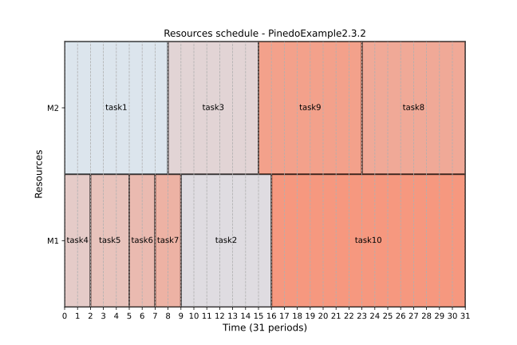
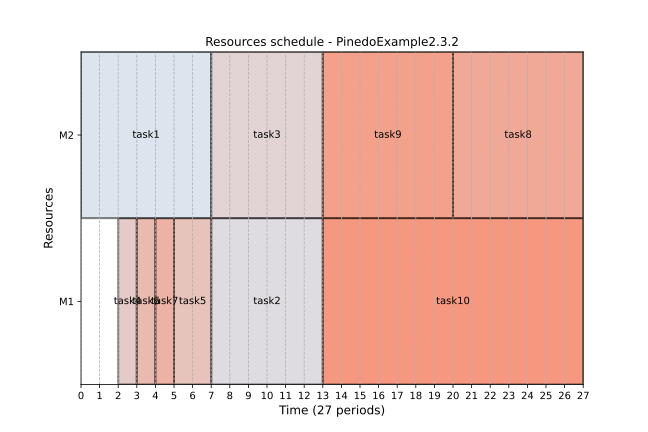

# Scheduling. Theory, Algorithms, and Systems

This section is a collection of examples from the [Michael Pinedo](https://wp.nyu.edu/michaelpinedo/)'s famous book:

Pinedo, Michael. L. (2012) "Scheduling. Theory, Algorithms, and Systems". 4th edition. Springer New York, NY. ISBN  doi: [10.1007/978-1-4614-2361-4](https://doi.org/10.1007/978-1-4614-2361-4)

## Example 2.3.2 (A Scheduling Anomaly)

Consider an instance of P2 | prec | Cmax with 10 jobs and the following
processing times.


| jobs n° | pj |
|---------|----|
| 1 | 8 |
| 2 | 7 |
| 3 | 7 |
| 4 | 2 |
| 5 | 3 |
| 6 | 2 |
| 7 | 2 |
| 8 | 8 |
| 9 | 8 |
| 10 | 15 |

The python code to represent jobs and durations is:

``` py
problem = ps.SchedulingProblem(name="PinedoExample2.3.2")

durations = [8, 7, 7, 2, 3, 2, 2, 8, 8, 15]
jobs = []

i = 1
for pj in durations:
    jobs.append(ps.FixedDurationTask(name=f"task{i}", duration=pj))
    i +=1
```

All tasks can be handled by two machines:

``` py

# two machines
machine_1 = ps.Worker(name="M1")
machine_2 = ps.Worker(name="M2")

# resource assignment: each job can be processed eithe by machine_1
# or machine_2
for j in jobs:
    j.add_required_resource(ps.SelectWorkers(list_of_workers=[machine_1, machine_2]))
```

The precedences are given by the graph:

{ width="300" }

In python,

``` py
# precedences
precs_graph = [(1, 2), (1, 3), (2, 10), (3, 10),
               (5, 3),
               (4, 5), (4, 6), (5, 8), (6, 7), (7, 9), (5, 9), (7, 8)]

for i, j in precs_graph:
    ps.TaskPrecedence(task_before=jobs[i-1], task_after=jobs[j-1])
```

The nondelay schedule requires that no machine is kept idle while an operation is waiting for processing. In other words, all tasks assigned to any resource must be contigous.

``` py
# non delay schedule
ps.ResourceNonDelay(resource=machine_1)
ps.ResourceNonDelay(resource=machine_2)
```

Finally, solve by optimizing the total completion time and render:

``` py
ps.ObjectiveMinimizeMakespan()
solver = ps.SchedulingSolver(problem=problem)
solution = solver.solve()
ps.render_gantt_matplotlib(solution)
```

We obtain:

{ width="100%" }

Wich is similar to the solution of the book with a makespan of 31:

{ width="100%" }

Now, each one of the ten processing times is reduced by one time unit, that is to say:

``` py
durations = [7, 6, 6, 1, 2, 1, 1, 7, 7, 14]
```

We solve the problem in the same way and obtain:
{ width="100%" }

Here the conclusion is sligthly different from the one from Pinedo's book, where "one would expect that, if each one of the ten processing times is reduced by one time unit, the makespan would be less than 31. However, requiring the schedule to be non-delay results in the schedule depicted in [..] with a makespan of 32". Our solution has a makespan of 27.

With 3 machines and the original settings, we get:

{ width="100%" }

which also conflicts with Pinedo's conclusion claiming that the makespan is now 36 whereas ours is only 30.

## Example 3.2.5 (Minimizing Maximum Lateness)

Consider the following 4 jobs.

| jobs | $p_j$ | $r_j$ | $d_j$ |
| ---- | -- | -- | -- |
| 1    | 4  | 0  | 8 |
| 2    | 2  | 1  | 12 |
| 3    | 6  | 3  | 11 |
| 4    | 5  | 5  | 10 |

This can be represented by the following python code:
```py
problem = ps.SchedulingProblem(name="PinedoExample3.2.5")

J1 = ps.FixedDurationTask(
    name="J1", duration=4, release_date=0, due_date=8, due_date_is_deadline=False
)
J2 = ps.FixedDurationTask(
    name="J2", duration=2, release_date=1, due_date=12, due_date_is_deadline=False
)
J3 = ps.FixedDurationTask(
    name="J3", duration=6, release_date=3, due_date=11, due_date_is_deadline=False
)
J4 = ps.FixedDurationTask(
    name="J4", duration=5, release_date=5, due_date=10, due_date_is_deadline=False
)

M1 = ps.Worker(name="M1")
J1.add_required_resource(M1)
J2.add_required_resource(M1)
J3.add_required_resource(M1)
J4.add_required_resource(M1)
```

The maximum lateness optimization is achievd using:
``` py
lateness_indicator = ps.IndicatorMaximumLateness()
ps.ObjectiveMinimizeIndicator(target=ind, weight=1)
```

After solving, this gives the following Gantt chart, that confirms "that schedule 1, 3, 4, 2 has to be optimal".
{ width="100%" }

## Example 3.3.3 (Minimizing Number of Tardy Jobs)

Consider the following 5 jobs.

| jobs | $p_j$ | $d_j$ |
| ---- | -- | -- |
| 1    | 7  | 9  |
| 2    | 8  | 17 |
| 3    | 4  | 18 |
| 4    | 6  | 19 |
| 5    | 6  | 21 |

The implementation in python:

```py
problem = ps.SchedulingProblem(name="PinedoExample3.3.3")

J1 = ps.FixedDurationTask(name="J1", duration=7, due_date=9, due_date_is_deadline=False)
J2 = ps.FixedDurationTask(
    name="J2", duration=8, due_date=17, due_date_is_deadline=False
)
J3 = ps.FixedDurationTask(
    name="J3", duration=4, due_date=18, due_date_is_deadline=False
)
J4 = ps.FixedDurationTask(
    name="J4", duration=6, due_date=19, due_date_is_deadline=False
)
J5 = ps.FixedDurationTask(
    name="J5", duration=6, due_date=21, due_date_is_deadline=False
)

M1 = ps.Worker(name="M1")

for j in [J1, J2, J3, J4, J5]:
    j.add_required_resource(M1)

ind = ps.IndicatorNumberOfTardyTasks()
ps.ObjectiveMinimizeIndicator(target=ind, weight=1)
```

returns the following result:
{ width="100%" }


Confirms that "The optimal schedule is 3, 4, 5, 1, 2 with $\sum{U_j = 2}$" and "Note also that there may be many optimal schedules".