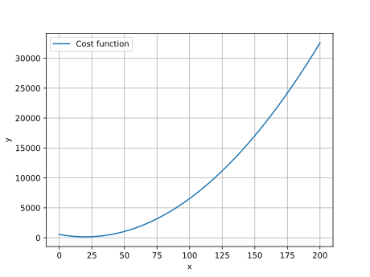

# Resource

According to the APICS dictionary, a resource is anything that adds value to a product or service in its creation, production, or delivery.

In the context of ProcessScheduler, a resource is anything that is needed by a task to be successfully processed. In a scheduling problem, resources can be human beings, machines, inventories, rooms or beds in an hotel or an hospital, elevator etc.

ProcessScheduler provides the following classes to deal with resources: `Worker`, `CumulativeWorker` 


The inheritance class diagram is the following:
``` mermaid
classDiagram
  Resource <|-- Worker
  Resource <|-- CumulativeWorker
```

## Worker

A Worker is an atomic, countable resource. Being atomic implies that it cannot be further divided into smaller parts, and being countable means it exists in a finite number, available during specific time intervals. The `Worker` class is ideal for representing entities like machines or humans. A `Worker` possesses the capacity to process tasks either individually or in collaboration with other workers or resources.

To create a Worker, you can use the following syntax:

``` py
john = Worker(name='JohnBenis')
```

## CumulativeWorker

On the other hand, a `CumulativeWorker` can simultaneously handle multiple tasks in parallel. The maximum number of tasks that a `CumulativeWorker` can process concurrently is determined by the `size` parameter.

For example, you can define a CumulativeWorker like this:

``` py
# the machine A can process up to 4 tasks at the same time
machine_A = CumulativeWorker(name='MachineA',
                             size=4)
```

## Resource productivity

The `productivity` attribute of a worker represents the amount of work the worker can complete per period. By default, a worker's `productivity` is set to 1.

For instance, if you have two drillers, with the first one capable of drilling 3 holes per period and the second one drilling 9 holes per period, you can define them as follows:

``` py
driller_1 = Worker(name='Driller1',
                   productivity=3)
driller_2 = Worker(name='Driller1',
                   productivity=9)
```

!!! note

  The workers :const:`productivity` is used by the solver to satisfy the targeted task `work_amount` parameter value.

## Resource cost

You can associate cost information with any resource, enabling ProcessScheduler to compute the total cost of a schedule, the cost per resource, or optimize the schedule to minimize costs (see the Objective section for details).

The resource cost can be defined as a **time dependent [Function](function.md)**.

### Constant Cost Per Period

In this approach, the resource's cost remains constant over time.

``` py
dev_1 = Worker(name='SeniorDeveloper',
               cost=ConstantFunction(750))
```

$$C(t) = k, k \in \mathbb{N}$$

### Linear Cost Function :

$$C(t)=slope * t + intercept, (slope, intercept) \in \mathbb{N} \times \mathbb{N}$$

``` py
dev_1 = Worker(name='SeniorDeveloper',
               cost=LinearFunction(slope=2, intercept=23))
```

### Polynomial Cost Function

$$C(t)={a_n}t^n + {a_{n-1}}t^{n-1} + ... + {a_i}t^i + ... + {a_1}t+{a_0}$$

This method allows you to represent resource costs as a polynomial function of time. It's particularly useful for modeling costs that are volatile (e.g., oil prices) or time-dependent (e.g., electricity costs). The cost parameter accepts any Python callable object.

``` py
def quadratic_time_function(t):
    return (t-20)**2 + 154
dev_1 = Worker(name='AWorker',
               cost=PolynomialFunction(coefficients = [400, 0, 20]))
```

The worker `cost` is set to `None` by default.

You can visualize the cost function using Matplotlib, which provides insights into how the cost evolves over time:

``` py
cost_function.plot([0, 200])
```


!!! warning

    Currently, ProcessScheduler can handle integer numbers only. Then, all the coefficients of the polynomial must be integer numbers. If ever there are floating point numbers, no exception will be raised, but you might face strange results in the cost computation.

!!! note

  The worker `cost` is useful to measure the total cost of a resource/a set of resources/a schedule, or to find the schedule that minimizes the total cost of a resource/a set of resources/ a schedule.
