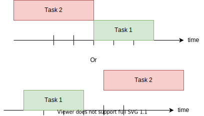

# Task Constraints

The ProcessScheduler framework provides a powerful set of predefined temporal task constraints to facilitate the expression of common scheduling rules efficiently. These constraints empower you to articulate task-related regulations, such as fixed start times, synchronized endings, precedence relationships, and more.

The `TaskConstraint` class is a specialized extension of the generic `Constraint` class, forming the foundation for expressing task-related scheduling rules.

``` mermaid
classDiagram
  Constraint <|-- TaskConstraint
```

!!! note

    Constraints that start with ``Task*`` apply to a single task, while those starting with ``Tasks***`` apply to two or more task instances.

!!! note

    All Task constraints can be defined as either mandatory or optional. By default, constraints are mandatory (parameter optional=False). If you set the optional attribute to True, the constraint becomes optional and may or may not apply based on the solver's discretion. You can force the schedule to adhere to an optional constraint using the task.applied attribute:

    ``` py
    pb.add_constraint([task.applied == True])
    ```

## Single task temporal constraints

These constraints apply to individual tasks.

``` mermaid
classDiagram
  TaskConstraint <|-- TaskStartAt
  TaskConstraint <|-- TaskStartAfter
  TaskConstraint <|-- TaskEndAt
  TaskConstraint <|-- TaskEndBefore
class TaskStartAt{
    +Task task
    +int value
  }
class TaskStartAfter{
    +Task task
    +int value    
}
class TaskEndAt{
    +Task task
    +int value
}
class TaskEndBefore{
    +Task task
    +int value
}
```

### TaskStartAt

Ensures that a tasks starts precisely at a specified time instant.

`TaskStartAt`: takes two parameters `task` and `value` such as the task starts exactly at the instant

$$task.start = value$$

### TaskStartAfter

Enforces that a task must start after a given time instant.

`TaskStartAfterStrict` can be strict lor lax.

$$task.start >= value$$

### TaskEndAt

Ensures that a task ends precisely at a specified time instant.

$$task.end = value$$

`TaskEndAt`: takes two parameters `task` and `value` such as the task ends exactly at the instant *value*.

### TaskEndBefore

Requires that a task ends before or at a given time instant.

$$task.end <= value$$

`TaskEndBefore` can be strict or lax.


## Two tasks temporal constraints

These constraints apply to sets of two tasks.


``` mermaid
classDiagram
  TaskConstraint <|-- TaskPrecedence
  TaskConstraint <|-- TasksStartSynced
  TaskConstraint <|-- TasksEndSynced
  TaskConstraint <|-- TasksDontOverlap
class TaskPrecedence{
    +Task task_before
    +Task task_after
    +str kind
    +int offset
}
  
```

### TaskPrecedence

Ensures that one task is scheduled before another. The precedence can be either 'lax,' 'strict,' or 'tight,' and an optional offset can be applied.

The `TaskPrecedence` class takes two parameters `task_1` and `task_2` and constraints `task_2` to be scheduled after `task_1` is completed. The precedence type can either be :const:`'lax'` (default, `task_2.start` >= `task_1.end`)), :const:`'strict'` (`task_2.start` >= `task_1.end`)) or :const:`'tight'` (`task_2.start` >= `task_1.end`, task_2 starts immediately after task_1 is completed). An optional parameter `offset` can be additionally set.

``` py
task_1 = ps.FixedDurationTask(name='Task1', duration=3)
task_2 = ps.FixedVariableTask(name='Task2')
pc = TaskPrecedence(task_before=task1,
                    task_after=task2,
                    kind='tight',
                    offset=2)
```
constraints the solver to schedule task_2 start exactly 2 periods after task_1 is completed.

### TasksStartSynced

Specify that two tasks must start at the same time.

`TasksStartSynced` takes two parameters `task_1` and `task_2` such as the schedule must satisfy the constraint :math:`task_1.start = task_2.start`

{ width=90% }

### TasksEndSynced

Specify that two tasks must end at the same time.

`TasksEndSynced` takes two parameters `task_1` and `task_2` such as the schedule must satisfy the constraint :math:`task_1.end = task_2.end`

{ width=90% }

### TasksDontOverlap

Ensures that two tasks should not overlap in time.

`TasksDontOverlap` takes two parameters `task_1` and `task_2` such as the task_1 ends before the task_2 is started or the opposite (task_2 ends before task_1 is started)

{ width=90% }

## $n$ tasks temporal constraints

### TasksContiguous

Forces a set of tasks to be scheduled contiguously.

`TasksContiguous` takes a liste of tasks, force the schedule so that tasks are contiguous.

### UnorderedTaskGroup

An UnorderedTaskGroup represents a collection of tasks that can be scheduled in any order. This means that the tasks within this group do not have a strict temporal sequence.

### OrderedTaskGroup

A set of tasks that can be scheduled in any order, with time bounds

## Advanced tasks constraints

### ScheduleNTasksInTimeIntervals

Schedules a specific number of tasks within defined time intervals.

Given a list of :math:`m` tasks, and a list of time intervals, `ScheduleNTasksInTimeIntervals` schedule :math:`N` tasks among :math:`m` in this time interval.

### ResourceTasksDistance

Defines constraints on the temporal distance between tasks using a shared resource.

`ResourceTasksDistance` takes a mandatory attribute `distance` (integer), an optional `time_periods` (list of couples of integers e.g. [[0, 1], [5, 19]]). All tasks, that use the given resource, scheduled within the `time_periods` must have a maximal distance of `distance` (distance being considered as the time between two consecutive tasks).

!!! note

    If the task(s) is (are) optional(s), all these constraints apply only if the task is scheduled. If the solver does not schedule the task, these constraints does not apply.

## Logical task constraints

### OptionalTaskConditionSchedule

Creates a constraint that schedules a task based on a specified Boolean condition.

`OptionalTaskConditionSchedule` creates a constraint that adds a condition for the task to be scheduled. The condition is a z3 BoolRef

### OptionalTasksDependency

`OptionalTasksDependency` takes two optional tasks `task_1` and `task_2`, and ensures that if task_1 is scheduled then that task_2 is forced to be scheduled as well.

### ForceScheduleNOptionalTasks

Forces the scheduling of a specified number of optional tasks out of a larger set of optional tasks.

`ForceScheduleNOptionalTasks` forces :math:`m` optional tasks among :math:`n` to be scheduled, with :math:`m \leq n`.
